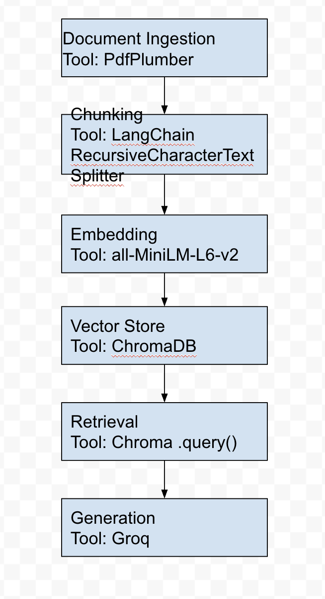

# Project 1 Planning: The Unofficial Guide

> Write this document before you write any pipeline code.
> Your spec and architecture diagram are what you'll use to direct AI tools (Claude, Copilot, etc.) to generate your implementation — the more specific they are, the more useful the generated code will be.
> Update the Retrieval Approach and Chunking Strategy sections if you change your approach during implementation.
> Update this file before starting any stretch features.

---

## Domain

<!-- What domain did you choose? Why is this knowledge valuable and hard to find through official channels? -->

Domain: Best study spots on campus. 

Often times you need a a quiet place to study and get work done. Official websites usually list Univeristy libraries or exclusively college facilities. However, University libraries can get very crowded, expecially during exam season. This app will list variety of study spots around campus including cafes/outdoor spots that are within walkable distance from campus. 

---

## Documents

<!-- List your specific sources: URLs, subreddit names, forum threads, or file descriptions.
     Aim for at least 10 sources that together cover different subtopics or perspectives within your domain. -->

| # |    Source      | Description                    | URL or location |
|---|----------------|--------------------------------|----------------------|
| 1 | HerCampus1.pdf      | Study Spots near GSU       |  ./pdfs/HerCampus1.pdf 
| 2 | StudyNearby.pdf        | Study Spots in GA          |            ./pdfs/StudyNearby.pdf 
| 3 | TheInsightDot.pdf  | Study Spots near GSU           |   ./pdf/sTheInsightDot.pdf
| 4 | HerCampus1.pdf      | Study Spots near GSU           |   ./pdfs/HerCampus1.pdf  
| 5 | Yelp.pdf          | Study Spots near Georgia Tech  |   ./pdf/sYelp.pdf 
| 6 | RamblerAtlanta.pdf | Study Spots near Georgia Tech  |  ./pdfs/RamblerAtlanta.pdf 
| 7 | GaTech.pdf   | Study Spots near Georgia Tech  |  ./pdfs/GATECH.pdf 
| 8 | RedAndBlack.pdf        | Study Spots near UGA |  ./pdfs/RedAndBlack.pdf
| 9 | RamblerAthens.pdf         | Study Spots near UGA  |  ./pdfs/RamblerAthens.pdf
| 10| Odyssey.pdf    | Study Spots near GSU |  ./pdfs/Odyssey.pdf 

---

## Chunking Strategy

<!-- How will you split documents into chunks?
     State your chunk size (in tokens or characters), overlap size, and explain why those
     numbers fit the structure of your documents.
     A review-heavy corpus warrants different chunking than a long FAQ. -->

**Chunk size:**
400
**Overlap:**
40
**Reasoning:**
Most of my documents are pretty structured bulleted text paragraphs. Each around 350-400 characters long. Which is why I used 400 characters chunk size. 
---

## Retrieval Approach

<!-- Which embedding model are you using (e.g., all-MiniLM-L6-v2 via sentence-transformers)?
     How many chunks will you retrieve per query (top-k)?
     If you were deploying this for real users and cost wasn't a constraint, what tradeoffs
     would you weigh in choosing a different embedding model — context length, multilingual
     support, accuracy on domain-specific text, latency? -->

**Embedding model:**
all-MiniLM-L6-v2 via sentence-transformers

**Top-k:**
5 chunks (k=5)

**Production tradeoff reflection:**
all-MiniLM-L6-v2 has a short context window (256 tokens per chunk). In production, I'd probably choose text-embedding-3-large (8191 token context window) to allow to larger documents.  

---

## Evaluation Plan

<!-- List your 5 test questions with their expected correct answers.
     Questions should be specific enough that you can judge whether the system's response
     is right or wrong. "What are good dining halls?" is too vague.
     "What do students say about wait times at [dining hall name] during lunch?" is testable. -->

| # | Question | Expected answer |
|---|----------|-----------------|
| 1 | What are some study spots near Georgia Tech that serves coffee or food? | Momo Cafe and Dancing Goats Cafe
| 2 | What are some study spots near GSU that require a Panther ID to access? | The Andrew Young School of Policy Studies 
| 3 | What are some study spots near Georgia Tech that are open until 10pm?   | Momo Cafe and Momokini
| 4 | What are some study spots near Georgia Tech that are outdoors?          | Roof of Crosland Tower
| 5 | What are some study spots near GSU that that are quiet?                 | Urban Life Building/Courtyard

---

## Anticipated Challenges

<!-- What could go wrong? Name at least two specific risks with reasoning.
     Consider: noisy or inconsistent documents, missing source attribution, off-topic
     retrieval, chunks that split key information across boundaries. -->

1. Missing source information

2. Off-topic retrievals 

---

## Architecture

<!-- Draw a diagram of your pipeline showing the five stages:
     Document Ingestion → Chunking → Embedding + Vector Store → Retrieval → Generation
     Label each stage with the tool or library you're using.
     You can use ASCII art, a Mermaid diagram, or embed a sketch as an image.
     You'll use this diagram as context when prompting AI tools to implement each stage. -->

     

---

## AI Tool Plan

<!-- For each part of the pipeline below, describe:
     - Which AI tool you plan to use (Claude, Copilot, ChatGPT, etc.)
     - What you'll give it as input (which sections of this planning.md, which requirements)
     - What you expect it to produce
     - How you'll verify the output matches your spec

     "I'll use AI to help me code" is not a plan.
     "I'll give Claude my Chunking Strategy section and ask it to implement chunk_text()
     with my specified chunk size and overlap" is a plan. -->

**Milestone 3 — Ingestion and chunking:**
AI: Claude
Input: I'll ask Claude to implement a chunking strategy with a size of 400 and 40 overlap. 
Expected: It implements a function with the specific size. 
Verify: Check the chunk size and whether it provides good data. 

**Milestone 4 — Embedding and retrieval:**
AI: Claude
Input: I'll ask Claude to embed the data with the given model and k=5. 
Expected: It'll do embedding. 
Verify: Give it a prompt and check if it retrieves the top 5 relevant data. 

**Milestone 5 — Generation and interface:**
AI: Claude
Input: Design the app interface with Gradio. Contain Query, Answer, and Source fields.
Expected: It generates the interface with the given fields
Verify: Check the interface has been generated and actually gives the correct output. 
